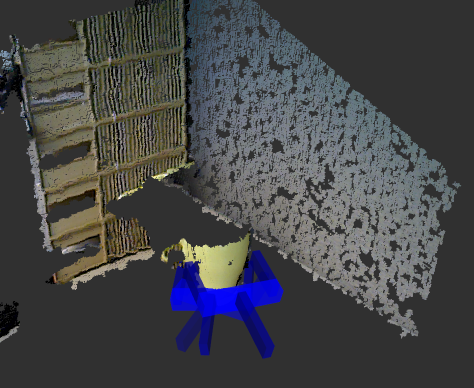

# Tutorial 1 - Detect Grasps With an RGBD Camera


In this tutorial, we will detect grasp poses using an RGBD camera such as the *Microsoft Kinect* or *Asus Xtion Pro*. 


## 1. Setup

Connect an RGBD camera to your robot/computer.

All of the following commands need to be run in separate terminals/tabs. First, start the driver for your camera.
```
roslaunch openni2_launch openni2.launch
```

Next, start rviz.
```
rosrun rviz rviz
```
In *rviz*, load the config file *gpd/tutorials/openni2.rviz*.


## 2. Detect Grasps

Launch the ROS node that detects grasps. 
```
roslaunch gpd tutorial1.launch
```
This will produce grasps on the ROS topic */detect_grasps/grasps*. An example is shown below.




## 3. Use the Grasps in Python

To use the grasps, start up your favorite Python editor and enter the following code.

```python
import rospy
from gpd.msg import GraspConfigList

# global variable to store grasps
grasps = []


# Callback function to receive grasps.
def callback(msg):
    global grasps
    grasps = msg.grasps


# ==================== MAIN ====================
# Create a ROS node.
rospy.init_node('get_grasps')

# Subscribe to the ROS topic that contains the grasps.
sub = rospy.Subscriber('/detect_grasps/clustered_grasps', GraspConfigList, callback)

# Wait for grasps to arrive.
rate = rospy.Rate(1)

while not rospy.is_shutdown():
    print '.'
    if len(grasps) > 0:
        rospy.loginfo('Received %d grasps.', len(grasps))
        break
    rate.sleep()
```

This code creates a ROS node that waits for grasps. Once grasps arrive, the node prints the number of grasps 
receveived and exits. You can start from this code to use our grasp detection algorithm on your robot!


## 2. Troubleshoot

### No Grasps Found

If the algorithm does not find grasps, it's usually because the workspace (`workspace`) is too large or that the number 
of samples (`num_samples`) drawn from the point cloud is too small. You can change the corresponding parameters in the 
launch file (*launch/openni2_15_channels.launch*).


## 3. Switching to PCL visualization

If you prefer PCL's cloud visualization, open the file *launch/openni2_15_channels.launch*, set the parameter 
`rviz_topic` to an empty string, *""*, and set any of the parameters starting with `plot_` to *True*. Those parameters allow to plot 
different steps in the algorithm. For example, the following setting plots the detected grasps using pcl.
```
<param name="plot_normals" value="false" />
<param name="plot_samples" value="false" />    
<param name="plot_candidates" value="false" />
<param name="plot_filtered_grasps" value="false" />
<param name="plot_valid_grasps" value="false" />
<param name="plot_clusters" value="false" />
<param name="plot_selected_grasps" value="false" />
<param name="rviz_topic" value="grasps_rviz" />
```
