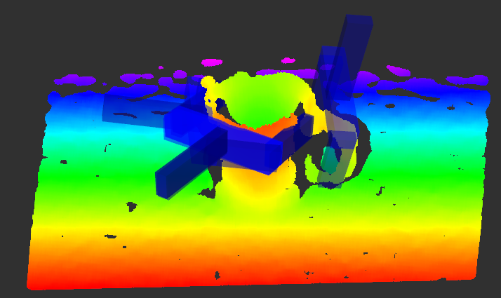
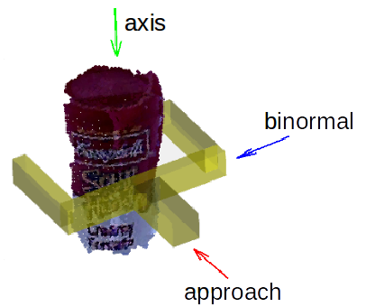

# Tutorial 2 - Detect Grasps on a Single Object


In this tutorial, we will detect grasp poses for a single object on a table and select a grasp for the robot to execute.


## 1. Remove the Plane

To find grasps on a single object, we will fit a plane to the point cloud and use the nonplanar indices to sample grasp 
candidates. 

We do this first with a PCD file. One way to load a PCD file in Python is to publish the file on a ROS 
topic.
```
rosrun pcl_ros pcd_to_pointcloud src/gpd/tutorials/table_mug.pcd
```

Next, we create a ROS node in Python that gets the point cloud from the topic (*/cloud_pcd*).
```python
import rospy
from sensor_msgs.msg import PointCloud2
from sensor_msgs import point_cloud2

cloud = [] # global variable to store the point cloud

def cloudCallback(msg):
    global cloud
    if len(cloud) == 0:
        for p in point_cloud2.read_points(msg):
            cloud.append([p[0], p[1], p[2]])


# Create a ROS node.
rospy.init_node('select_grasp')

# Subscribe to the ROS topic that contains the grasps.
cloud_sub = rospy.Subscriber('/cloud_pcd', PointCloud2, cloudCallback)

# Wait for point cloud to arrive.
while len(cloud) == 0:
    rospy.sleep(0.01)
```

To find the nonplanar indices, we first do a 
[least squares fit](https://www.geometrictools.com/Documentation/LeastSquaresFitting.pdf) of the points to a plane, and 
then we select the points that are at least a minimum distance away from that fitted plane.
```python
import numpy as np
from scipy.linalg import lstsq

cloud = np.asarray(cloud)
A = np.c_[cloud[:,0], cloud[:,1], np.ones(cloud.shape[0])]
b = cloud[:,2]
C, _, _, _ = lstsq(A, b)
a, b, c, d = C[0], C[1], -1., C[2] # coefficients of the form: a*x + b*y + c*z + d = 0.
dist = ((a*cloud[:,0] + b*cloud[:,1] + d) - cloud[:,2])**2
err = dist.sum()
idx = np.where(dist > 0.01)
```

Finally, we publish the point cloud and the indices at which we want to sample grasp candidates.
```python
# Publish point cloud and nonplanar indices.
from gpd.msg import CloudIndexed
from std_msgs.msg import Header, Int64
from geometry_msgs.msg import Point

pub = rospy.Publisher('cloud_indexed', CloudIndexed, queue_size=1)

msg = CloudIndexed()
header = Header()
header.frame_id = "/base_link"
header.stamp = rospy.Time.now()
msg.cloud_sources.cloud = point_cloud2.create_cloud_xyz32(header, cloud.tolist())
msg.cloud_sources.view_points.append(Point(0,0,0))
for i in xrange(cloud.shape[0]):
    msg.cloud_sources.camera_source.append(Int64(0))
for i in idx[0]:
    msg.indices.append(Int64(i))    
s = raw_input('Hit [ENTER] to publish')
pub.publish(msg)
rospy.sleep(2)
print 'Published cloud with', len(msg.indices), 'indices'
```

You can find the complete code in *scripts/select_grasp.py*. To test the code, start roscore, rviz, and the grasp 
detection node (in separate terminals).
```
roscore
rosrun rviz rviz
roslaunch gpd tutorial2.launch
```

In *rviz*, load the config file *gpd/tutorials/tutorial2.rviz*.

Then, run the *select_grasp.py* node.
```
python src/gpd/scripts/select_grasp.py
```

Send a PCD file to the the *select_grasp* node.
```
rosrun pcl_ros pcd_to_pointcloud src/gpd/tutorials/table_mug.pcd
```

Hit the Enter key when asked. It takes a while to calculate the surface normals (about a minute on a 
*3Ghz Intel i7 CPU*). Now you should see grasps in rviz as shown below.




## 3. Select a Grasp in Python

To select a grasp for the robot to execute, we use a simple heuristic: we just pick the grasp with the largest 
classification score.

```python
# Select a grasp for the robot to execute.
from gpd.msg import GraspConfigList

grasps = [] # global variable to store grasps

def callback(msg):
    global grasps
    grasps = msg.grasps

# Subscribe to the ROS topic that contains the grasps.
grasps_sub = rospy.Subscriber('/detect_grasps/clustered_grasps', GraspConfigList, callback)

# Wait for grasps to arrive.
rate = rospy.Rate(1)

while not rospy.is_shutdown():    
    if len(grasps) > 0:
        rospy.loginfo('Received %d grasps.', len(grasps))
        break

grasp = grasps[0] # grasps are sorted in descending order by score
print 'Selected grasp with score:', grasp.score
```

After selecting a grasp, you can get the information about where to place the robot hand 
from the *GraspConfig* message. Here is a visualization of the orientation.



To use an actual RGBD camera on your robot instead of a PCD file, you can start by connecting the *select_grasp* node 
to *openni2* as in the first tutorial.


